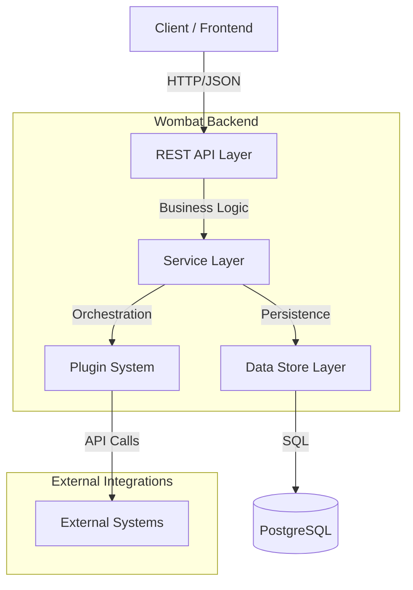
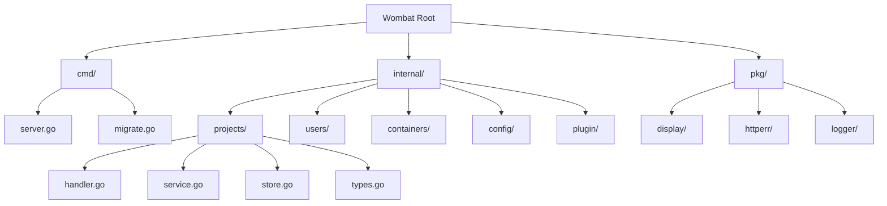
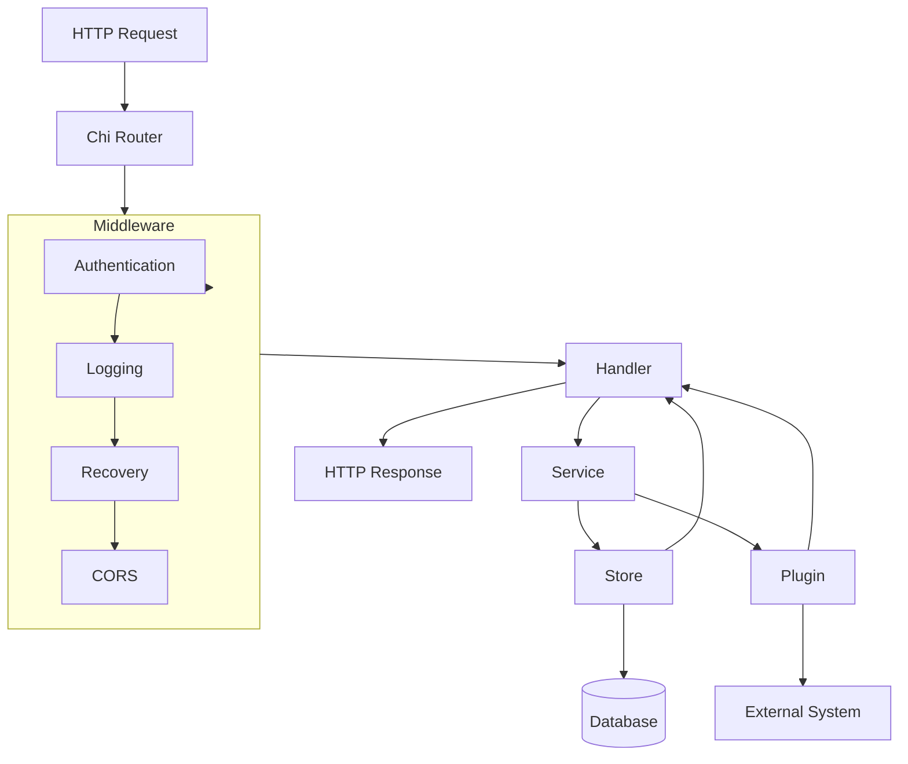
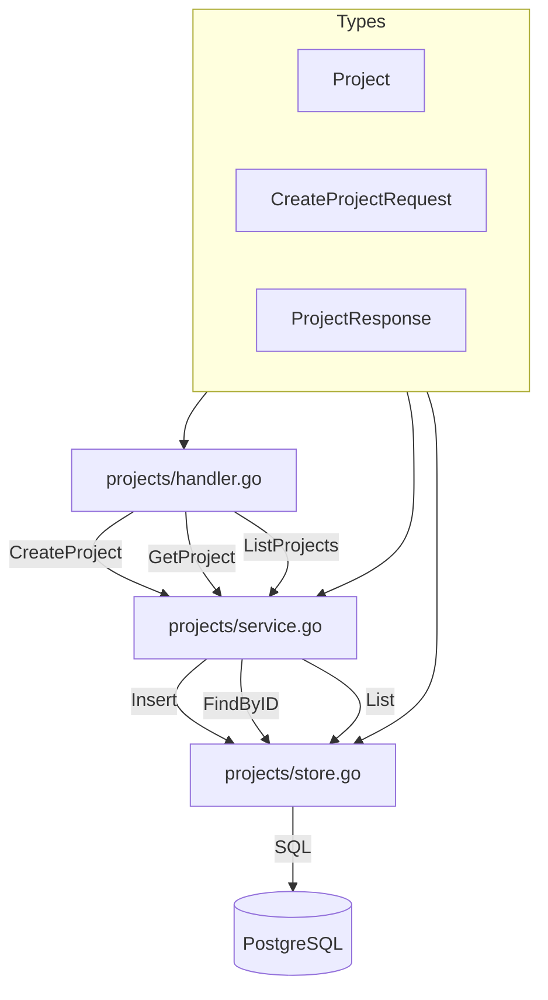
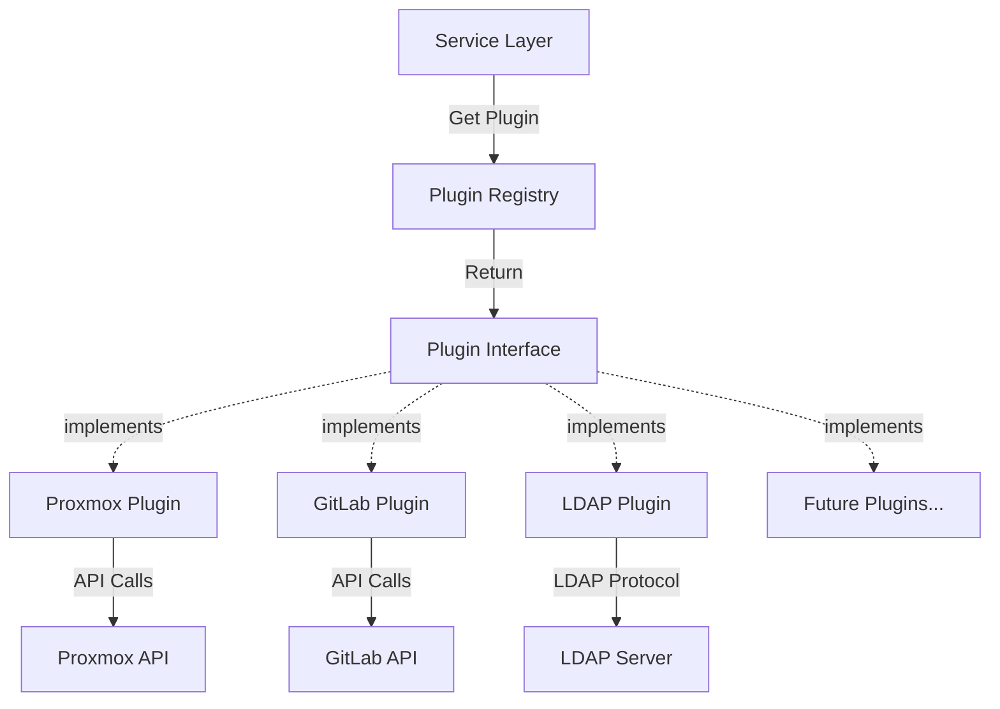
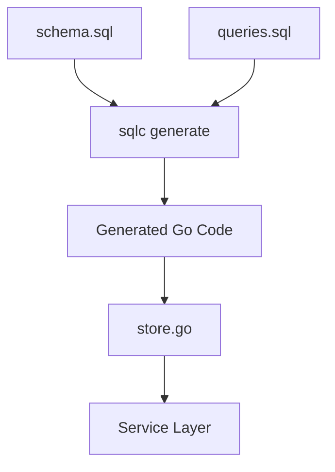
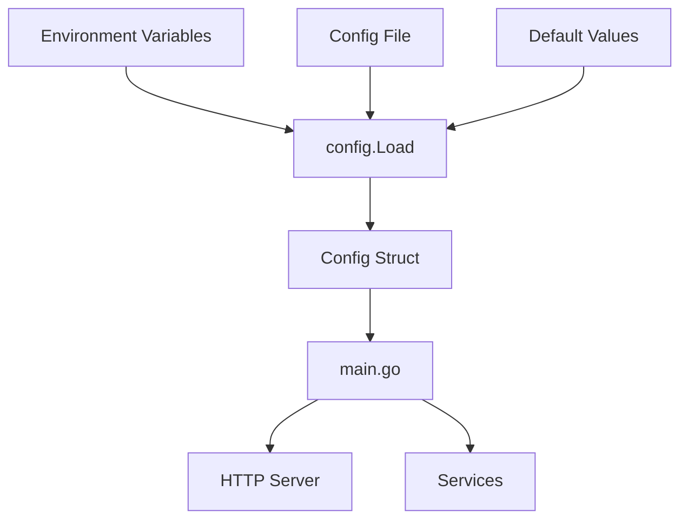
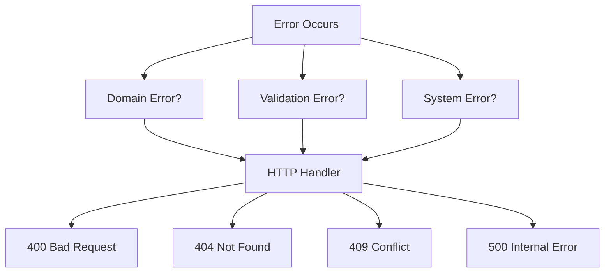
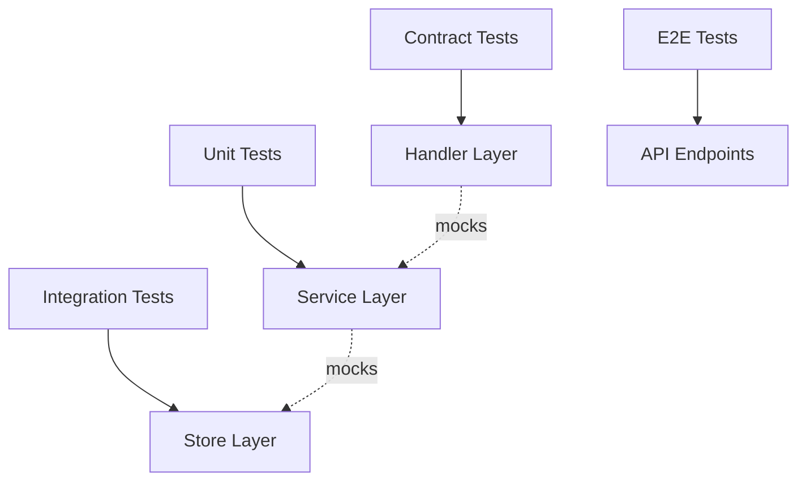

# Wombat Architecture

This document describes the architecture of Wombat Go rewrite — a modular monolith with plugin-based integrations.

**Design principles:**

- Clean architecture (handler → service → store)
- Domain-driven design
- Plugin system for integrations
- API-first (OpenAPI contracts)
- Scalable from spike to production

---

## High-Level Architecture



**Key components:**

- **API Layer:** HTTP handlers, request validation, OpenAPI
- **Service Layer:** Business logic, orchestration, transactions
- **Store Layer:** Database queries (sqlc), migrations
- **Plugin System:** Abstractions for external integrations
- **External Systems:** Proxmox, GitLab, LDAP, Rancher, etc.

---

## Module Structure

Wombat uses **vertical slice architecture** — each domain is self-contained.



**Directory layout:**

```text
.
├── cmd/                      # CLI commands
│   ├── server.go            # HTTP server
│   └── migrate.go           # DB migrations
├── internal/                 # Private application code
│   ├── projects/            # Projects domain
│   │   ├── handler.go       # HTTP handlers
│   │   ├── service.go       # Business logic
│   │   ├── store.go         # DB queries
│   │   └── types.go         # Domain types
│   ├── users/               # Users domain
│   ├── containers/          # Containers domain
│   ├── config/              # Configuration
│   └── plugin/              # Plugin system
│       ├── registry.go      # Plugin registry
│       ├── plugin.go        # Plugin interface
│       └── proxmox/         # Proxmox plugin
├── pkg/                     # Public reusable packages
│   ├── display/             # Terminal output
│   ├── httperr/             # HTTP error handling
│   └── logger/              # Structured logging
└── migrations/              # SQL migrations
```

---

## Request Flow



**Flow steps:**

1. **Request** arrives at HTTP server
2. **Router** matches endpoint
3. **Middleware** chain processes request:
   - Authentication (future)
   - Logging
   - Panic recovery
   - CORS
4. **Handler** validates input, calls service
5. **Service** executes business logic:
   - Calls store for persistence
   - Calls plugins for external operations
6. **Store** executes SQL queries
7. **Plugin** orchestrates external systems
8. **Handler** formats response (JSON)
9. **Response** returned to client

---

## Domain Structure (Example: Projects)

Each domain follows the same pattern.



**Responsibilities:**

**handler.go:**

- HTTP request/response
- Input validation
- Error mapping
- No business logic

```go
func (h *Handler) CreateProject(w http.ResponseWriter, r *http.Request) {
    var req CreateProjectRequest
    if err := json.NewDecoder(r.Body).Decode(&req); err != nil {
        httperr.BadRequest(w, "invalid JSON")
        return
    }

    project, err := h.service.Create(r.Context(), req)
    if err != nil {
        httperr.InternalError(w, err)
        return
    }

    json.NewEncoder(w).Encode(project)
}
```

**service.go:**

- Business logic
- Validation
- Orchestration
- Transactions

```go
func (s *Service) Create(ctx context.Context, req CreateProjectRequest) (*Project, error) {
    // Validate unix_name format
    if !isValidUnixName(req.UnixName) {
        return nil, ErrInvalidUnixName
    }

    // Check for duplicates
    exists, err := s.store.ExistsByUnixName(ctx, req.UnixName)
    if err != nil {
        return nil, err
    }
    if exists {
        return nil, ErrProjectExists
    }

    // Insert project
    return s.store.Create(ctx, req)
}
```

**store.go:**

- Database queries (sqlc)
- No business logic
- Returns domain types

```go
// Code generated by sqlc. DO NOT EDIT.

func (q *Queries) CreateProject(ctx context.Context, arg CreateProjectParams) (Project, error) {
    row := q.db.QueryRowContext(ctx, createProject,
        arg.Name,
        arg.UnixName,
        arg.Description,
    )
    var p Project
    err := row.Scan(&p.ID, &p.Name, &p.UnixName, &p.Description, &p.CreatedAt)
    return p, err
}
```

**types.go:**

- Domain models
- Request/Response DTOs
- Validation tags

```go
type Project struct {
    ID          string    `json:"id"`
    Name        string    `json:"name"`
    UnixName    string    `json:"unix_name"`
    Description string    `json:"description,omitempty"`
    Active      bool      `json:"active"`
    CreatedAt   time.Time `json:"created_at"`
}

type CreateProjectRequest struct {
    Name        string `json:"name" validate:"required,min=3,max=255"`
    UnixName    string `json:"unix_name" validate:"required,alphanum,min=3,max=100"`
    Description string `json:"description,omitempty"`
}
```

---

## Plugin System

Plugins enable integration with external systems without tight coupling.



**Plugin interface:**

```go
// plugin/plugin.go
package plugin

type Plugin interface {
    Name() string
    Health(ctx context.Context) error
    Provision(ctx context.Context, req ProvisionRequest) (*ProvisionResult, error)
    Status(ctx context.Context, resourceID string) (*StatusResult, error)
    Deprovision(ctx context.Context, resourceID string) error
}

type ProvisionRequest struct {
    ProjectID   string
    ProjectName string
    Template    string
    Resources   map[string]interface{}
}

type ProvisionResult struct {
    ResourceID string
    Metadata   map[string]string
    Status     string
}

type StatusResult struct {
    Status   string
    Metadata map[string]string
}
```

**Plugin registry:**

```go
// plugin/registry.go
package plugin

type Registry struct {
    plugins map[string]Plugin
}

func NewRegistry() *Registry {
    return &Registry{plugins: make(map[string]Plugin)}
}

func (r *Registry) Register(p Plugin) {
    r.plugins[p.Name()] = p
}

func (r *Registry) Get(name string) (Plugin, error) {
    p, ok := r.plugins[name]
    if !ok {
        return nil, ErrPluginNotFound
    }
    return p, nil
}
```

**Example plugin (Proxmox):**

```go
// plugin/proxmox/proxmox.go
package proxmox

import (
    "context"
    "os/exec"
    "github.com/Searge/wombat/internal/plugin"
)

type ProxmoxPlugin struct {
    cliPath string
}

func New(cliPath string) *ProxmoxPlugin {
    return &ProxmoxPlugin{cliPath: cliPath}
}

func (p *ProxmoxPlugin) Name() string {
    return "proxmox"
}

func (p *ProxmoxPlugin) Provision(ctx context.Context, req plugin.ProvisionRequest) (*plugin.ProvisionResult, error) {
    cmd := exec.CommandContext(ctx, p.cliPath, "create",
        "--name", req.ProjectName,
        "--template", req.Template,
    )

    output, err := cmd.CombinedOutput()
    if err != nil {
        return nil, err
    }

    // Parse output, extract resource ID
    return &plugin.ProvisionResult{
        ResourceID: "extracted-from-output",
        Status:     "creating",
    }, nil
}
```

---

## Database Layer

Uses **sqlc** for type-safe SQL queries.



**Development flow:**

1. Write schema in `migrations/001_initial.sql`
2. Write queries in `internal/projects/queries.sql`
3. Run `sqlc generate`
4. Use generated code in `store.go`

**Example query:**

```sql
-- name: GetProject :one
SELECT id, name, unix_name, description, active, created_at, updated_at
FROM projects
WHERE id = $1;

-- name: ListProjects :many
SELECT id, name, unix_name, description, active, created_at, updated_at
FROM projects
WHERE active = true
ORDER BY created_at DESC
LIMIT $1 OFFSET $2;

-- name: CreateProject :one
INSERT INTO projects (name, unix_name, description)
VALUES ($1, $2, $3)
RETURNING id, name, unix_name, description, active, created_at, updated_at;
```

---

## Configuration

Configuration is loaded once at startup and passed explicitly.



**No global state. Config is passed explicitly.**

```go
// internal/config/config.go
type Config struct {
    Server   ServerConfig
    Database DatabaseConfig
    Plugins  PluginConfig
}

type ServerConfig struct {
    Host string
    Port int
}

type DatabaseConfig struct {
    URL string
}

type PluginConfig struct {
    ProxmoxCLI string
}

// Load from environment and defaults
func Load() (*Config, error) {
    cfg := &Config{
        Server: ServerConfig{
            Host: getEnv("SERVER_HOST", "0.0.0.0"),
            Port: getEnvInt("SERVER_PORT", 8080),
        },
        Database: DatabaseConfig{
            URL: getEnv("DATABASE_URL", "postgres://localhost/wombat"),
        },
        Plugins: PluginConfig{
            ProxmoxCLI: getEnv("PROXMOX_CLI_PATH", "/usr/local/bin/forge-ovh-cli"),
        },
    }
    return cfg, nil
}
```

---

## Error Handling

Consistent error handling across the application.



**Error types:**

```go
// Domain errors (business logic)
var (
    ErrProjectNotFound   = errors.New("project not found")
    ErrProjectExists     = errors.New("project already exists")
    ErrInvalidUnixName   = errors.New("invalid unix name format")
)

// HTTP error mapping
func MapError(err error) (int, string) {
    switch {
    case errors.Is(err, ErrProjectNotFound):
        return http.StatusNotFound, "project not found"
    case errors.Is(err, ErrProjectExists):
        return http.StatusConflict, "project already exists"
    case errors.Is(err, ErrInvalidUnixName):
        return http.StatusBadRequest, "invalid unix name"
    default:
        return http.StatusInternalServerError, "internal error"
    }
}
```

---

## Testing Strategy



**Test types:**

**Unit tests (service layer):**

```go
func TestProjectService_Create(t *testing.T) {
    store := &mockStore{}
    service := NewService(store)

    req := CreateProjectRequest{
        Name:     "Test Project",
        UnixName: "test-project",
    }

    project, err := service.Create(context.Background(), req)
    require.NoError(t, err)
    assert.Equal(t, "test-project", project.UnixName)
}
```

**Integration tests (database):**

```go
func TestStore_CreateProject(t *testing.T) {
    db := setupTestDB(t)
    defer db.Close()

    store := NewStore(db)

    project, err := store.Create(context.Background(), CreateProjectParams{
        Name:     "Test",
        UnixName: "test",
    })

    require.NoError(t, err)
    assert.NotEmpty(t, project.ID)
}
```

---

## Future Scalability

The architecture supports these evolution paths:

**1. Microservices extraction:**

- Each domain (`projects/`, `users/`, etc) can become a separate service
- Plugin system already provides service boundaries
- Communication via API calls or message queue

**2. Event-driven architecture:**

- Add event bus (NATS, Kafka)
- Publish domain events
- Async processing for long operations

**3. CQRS:**

- Separate read and write models
- Read replicas for queries
- Write optimized for commands

**4. Multi-tenancy:**

- Add tenant_id to all tables
- Row-level security
- Tenant-isolated databases

**Current architecture doesn't prevent any of these. Start simple, evolve as needed.**

---

## See Also

- `docs/SPIKE.md` — 2-week proof of concept
- `docs/ROADMAP.md` — Full development timeline
- `AGENTS.md` — AI coding guidelines
- `README.md` — Project overview
